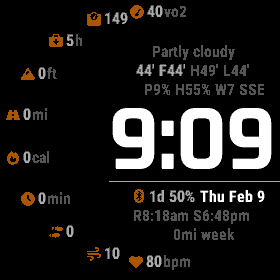

# All The Small Things Garmin Watch Face

A strongly opinionated Garmin watch face that cleanly surfaces all the outdoor running metrics you want without overloading your brain when you just want to check the time.

## Supported Devices

Devices with a 280x280 screen are currently supported:
* Descent™ Mk2 / Descent™ Mk2i
* Enduro™
* fēnix® 6X Pro / 6X Sapphire / 6X Pro Solar / tactix® Delta Sapphire / Delta Solar / Delta Solar - Ballistics Edition / quatix® 6X / 6X Solar / 6X Dual Power
* fēnix® 7X / tactix® 7 / quatix® 7X Solar / Enduro™ 2
* fēnix® 7X Pro

## Complications

Along the arc (bottom to top):
* Current Heart Rate
* Current Respiration Rate
* Current Day Steps
* Current Day Active Minutes
* Current Day Calories
* Current Day Distance
* Current Day Elevation Gain
* Recovery Time
* Weight
* VO2Max

Main area (top to bottom):
* Current Weather Conditions
* Current Temperature, Feels Like Temperature, Forecasted High Temperature, Forecasted Low Temperature
* Precipitation Chance, Relative Humidity, Wind Speed and Bearing
* Time
* Phone Connection Status, Battery Time Remaining, Battery Percent Remaining, Date
* Sunrise, Sunset
* Current Week Distance

## Limitations

You can have it in any color you like - so long as that color is orange!

## Known Issues

A screen refresh (press `Up-Menu` or `Down`) is required after changing colors in settings.

## Roadmap

I created this watch face for my own personal use, therefore there isn't much of an emphasis on customization at the moment.

Should people find this watch face useful and want to see configurable options for things such as colors or data fields, those might be things I add support for.

But at the moment, what you see is what you get.

## Changelog

A changelog for this project is kept in a changelog file: [CHANGELOG.md](CHANGELOG.md)

## Credits

Created by Clifford Oravec.

The icons used in this project are made available via CC BY 4.0 by [Font Awesome](https://github.com/FortAwesome/Font-Awesome).

## License

All The Small Things Garmin Watch Face is licensed under the terms of the GNU LGPLv3 license.